## Spotify - Clustering of support tickets using NLP methods

> **Data** - [Spotify Support Ticket Dataset](https://drive.google.com/file/d/15v-7NsMuhHZctsyGRfB_HazXsydEBpw5/view)

**The task**

The task is to write a Python program that clusters these messages in terms of similarity and outputs the results into 
a file (the representation is up to you, as long as it can be interpreted with relative ease).

The similarity criteria are up to you to decide, including the number of clusters and which of the attributes you use. 
You MUST use text-similarity of the message_body attribute as one of the criteria.

### Web-app for prediction service

To see things in action you can spin up a local web-server and make a request to the model service.

Simply run in a terminal from the project root `python web_app/app.py` and follow the link to your local host - 
[Spotify Ticket Tagging Service](http://127.0.0.1:5000/).

That should get you here:

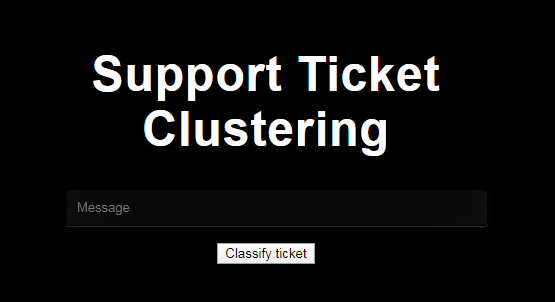

The application is rather clunky but works. Data would likely be fed through a programmatic API so this is just for 
demonstration purposes.

I'm sure you've done everything right and already have already a result on your screen. Well no? In that case
here's what it would look like if that was the case.

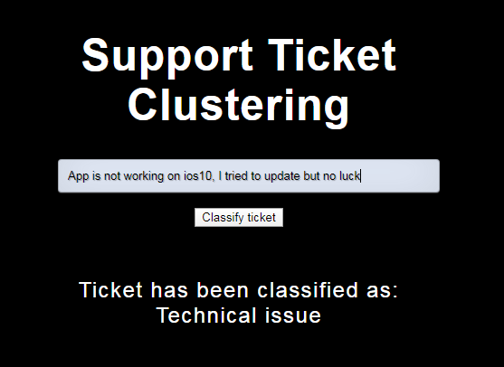

To see the inner workings of the Flask app go [here](../master/web_app/app.py).

### EDA, data quality fixes and feature engineering
[EDA Notebook](../master/exploratory_data_analysis.ipynb)

First I realised that datetime objects weren't parsing properly as a timezone aware object. So I fixed that.
Then I went into exploring the distribution of the various features in the data.

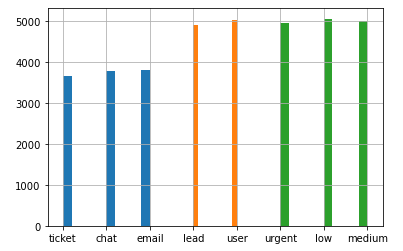

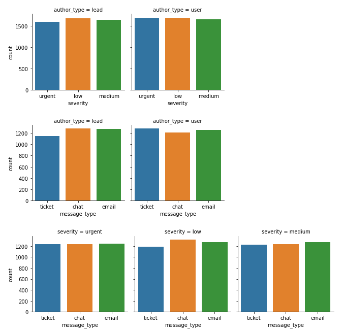

Regarding distribution over time, most data was collected in autumn/winter 2017 but there are
a few random tickets here and there dating back to 2013 or well after:

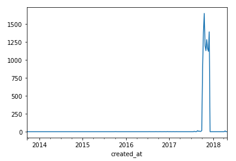

Decided to prune those outliers out.

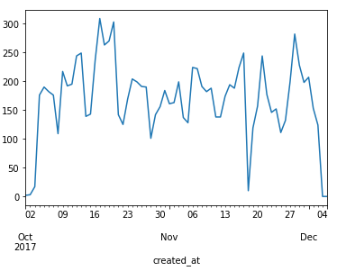

Went through a quick search for patterns between specific attributes over/under indexing in our data but 
didn't have much luck finding anything useful. Details in the notebook.

The last interesting fact regarding data distribution over days of week and hours of day. 
Most tickets are coming in the afternoon, evening and during night hours.

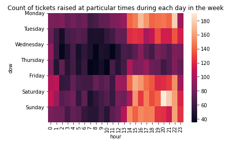

Then I dug into the text field. Realised it was Twitter data so played around with removing handles and doing some 
cleaning and parsing some of the removed parts of the text fields in additional columns.

Here are some examples of engineered features for exploration, the sentiment of the text body,
whether it contained a URL, distribution of character and word count over Tweets:

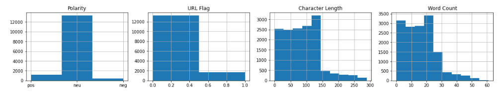

Overall I found that there were 23,295 words in the corpus. The most frequent of which:

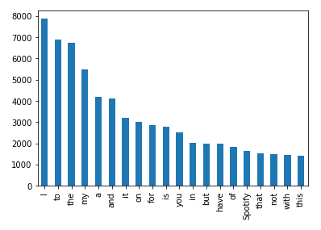

And after removing the stop-words that appear all over the place, this is more indicative:

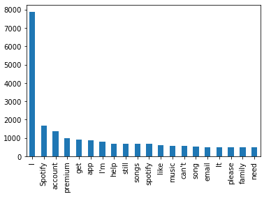

### Model training
[Modelling Notebook](../master/model_training.ipynb)

**Model Selection**

Choosing to go with **k-means** here being one of the easiest algos to implement for such a problem. Easy to attempt clustering with a lot of different number of clusters and use an elbow approach to optimise. 

**Feature Extraction**

It can be noted that k-means (and minibatch k-means) are very sensitive to feature scaling and that in this case the IDF weighting helps improve the quality of the clustering by quite a lot. This is the main reasoning behind the choise of TFIDVect over HashVect (though the latter could also be used with an L2 norm scaling). Additionally testing the use of latent semantic analysis (LSA -> SVD component) for dimensionality reduction.

**Evaluation Metric**

3 potential metrics to use where ground truth labels are not known in clustering. a) Devies-Bouldin Index b) Silhouette Coefficient and c) Calinski-Harabasz Index.

Chose to go with Silhouette Coefficient here as it's a lot more intuitive to use and to conceptually understand.

A simple intuitive explanation is:

    -1 <= coef < 0 then point would have been better off assigned to a different cluster, closer to -1 worse off it is
    coef = 0 right at the inflection point between clusters
    0 < coef <= 1 well-assigned, closer to 1 higher confidence

Actual definition: The Silhouette Coefficient is defined for each sample and is composed of two scores

**a**: The mean distance between a sample and all other points in the same class.

**b**: The mean distance between a sample and all other points in the next nearest cluster.

The Silhouette Coefficient s for a single sample is then given as:

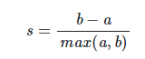

The Silhouette Coefficient for a set of samples is given as the mean of the Silhouette Coefficient for each sample.

LSA results:

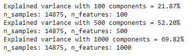

Given poor coverage at 1000 features and that overall we had <5000 total post-stop word filtering etc, 
I decided to drop dimensionality reduction at this point.

I re-run a parameter search several times, the first thing I noticed was that min_df was the most significant 
contributing factor towards silhouette score. The main issue here was that the more aggressively we pruned sparse 
words from our limited corpus of ~23k distinct words, we ended up with very few words per post to differentiate 
between clusters. The issue is with optimising for silhouette score. We end up with highly distinguishable clusters 
in a higher-dimensional place but in human terms we can't really distinguish between them. Probably an indication 
that silhouette score is not a very good measure in this case. Unfortunately didn't have time to investigate topic 
and word coherence measures, or try a probabilistic model and optimise on log-loss instead.

Maxing out at 12 clusters before we start having serious overlap. 12 may not be necessarily the optimal **interpretable** number but we can explore anything in the range 2-12.

Leveraging bi-grams and tri-grams helped a bit.

In the end for the sake of time, I decided to introduce some arbitrary cut-offs as I didn't have time to fully 
investigate. I set those after some trial and error to see which params yielded somewhat decent performance, while at
the same time maintaining enough humanly-perceivable interpretability.

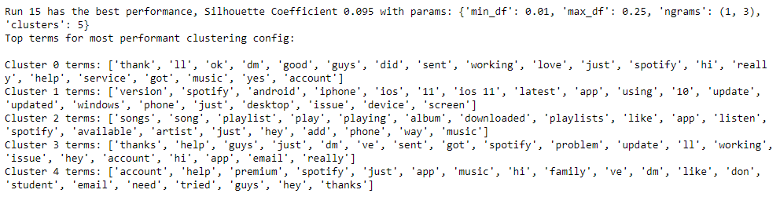

From the above I constructed themes as such:

1) General

2) Update related issue

3) Content related query (eg. song, artist or playlist availability)

4) Technical issue

5) Subscription and account related issue (eg. family account, premium subscription, student account)

Lastly, I trained a final pipeline based on those params and deployed the model in production on the web-app.

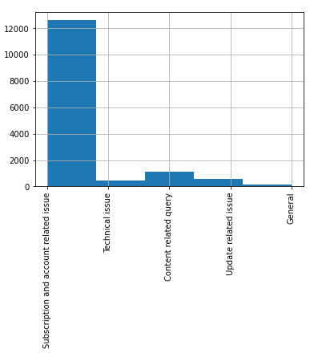

The main issue is the above with this model. Results are so skewed that this is not very useful. Parameter exploration
should help with smoothing out the distribution of topic allocation. **HOWEVER** given the specifics of this problem
I regret taking an embeddings approach. A simpler bag-of-words model would have done a much better job at creating 
a use-case specific vocabulary that could better capture the specific nuances of what differentiates two tickets. This 
is mainly due to the very limited corpus of Spotify tickets, unsurprisingly most customers talk about the same things
and hence, use the same words all the time. 

### Next steps & alternatives
1. Gaussian mixture model - probabilistic, so we can assess probability of being assigned to correct cluster and optimise with a log-loss function
2. LDA based topic modelling as an alternative (with GenSim/LDAVis for visual analysis)
3. Simple bag-of-words
